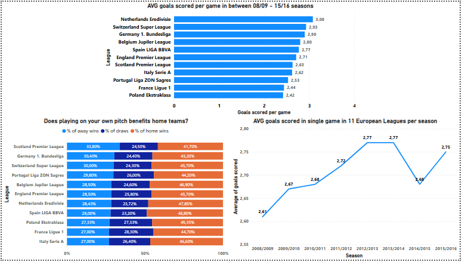

# European Football Analysis ⚽

Analysis of 26,000 football matches from 11 European leagues in seasons 2008/09 - 2015/16 using SQL and Power BI.

## Dashboard

## Key Findings
- 🥇 Netherlands Eredivisie is the highest-scoring league (3.08 goals/game)
- 🏠 Home advantage is real — home teams win ~45% of matches across all leagues
- 📈 Average goals per game peaked in 2013/14 season (2.77 goals/game)

## Tools Used
- **SQL** — data exploration and aggregation
- **Power BI** — interactive dashboard

## Data Source
[European Soccer Database](https://www.kaggle.com/datasets/hugomathien/soccer) — Kaggle (25,979 matches, 11 leagues)

## Workflow
SQL queries written in DBeaver, visualizations built in Power BI Desktop.
Claude AI used as a learning assistant during the process.
